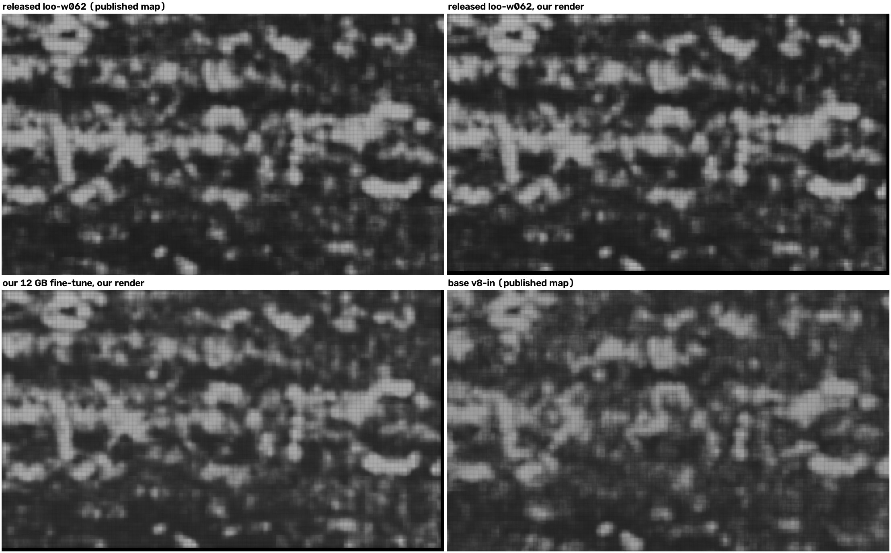
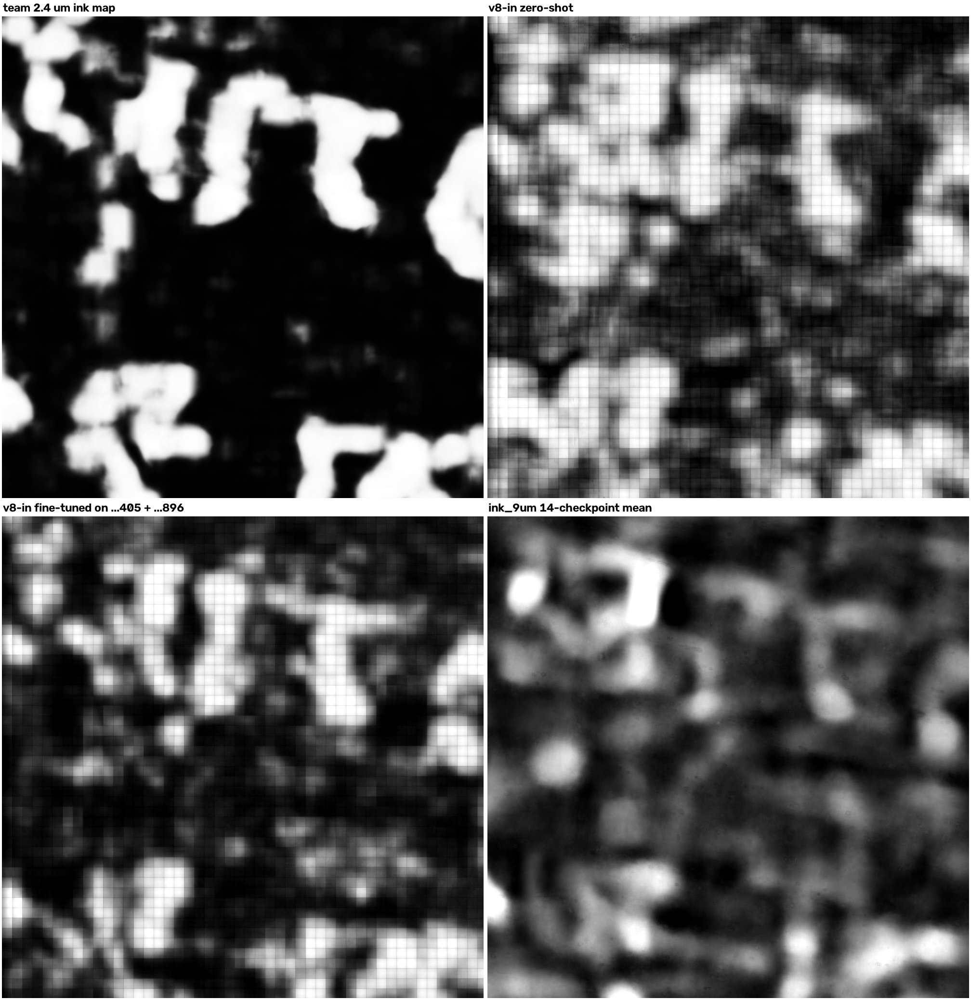
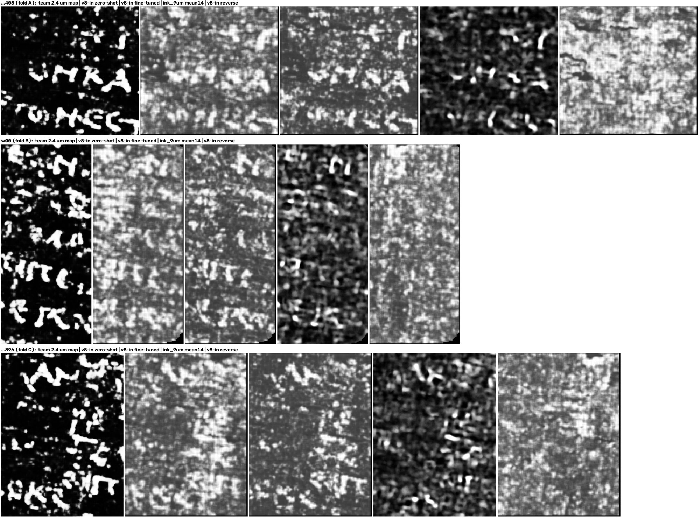

# v8-in on a 12 GB GPU: layer order from geometry, fine-tuning, and a test on an unseen scroll

[v8-in](https://huggingface.co/YoussefMoNader/ink-8um-v8in) is Youssef Nader's ink model for scans at ~8 µm, published on Hugging Face on 2026-09-28. This repository adds three tools and one measurement. Everything ran on one RTX 3060 (12 GB) capped at 120 W.

1. **`auto_order.py`** picks the depth order (forward or reverse) from the segment's geometry, so you do not have to run both. It picked the right order on all six windings we checked (three of PHerc0841, three of PHerc1447), for renders made with and without `--flip-normals` (section 1).
2. **`finetune.py`** fine-tunes v8-in on your own labelled segments on a 12 GB card. Retrained this way, the released PHerc1447 fine-tune (loo-w062) gives a map of its held-out winding that correlates r = 0.972 with the released model's map (section 2).
3. **`predict.py`** runs the released inference recipe on a `layers/` directory or a zarr surface volume, in the order you choose.
4. **A test on a scroll v8-in never saw**, PHerc0841, with the team's labels on three segments (section 3):
   - zero-shot, v8-in detects ink better than the First Letters model ink_9um on each segment (AUC 0.807-0.837 vs 0.756-0.813), but renders letters as blobs;
   - fine-tuned on two windings and read on the third, detection changes by −0.015 / +0.042 / +0.024 AUC and the letter-shape measure does not move.

## Quick start

```bash
pip install -r requirements.txt
# 1. which depth order? (reads the segment's tifxyz and a coarse level of the masked scan, anonymously from S3)
python auto_order.py SEGMENT/tifxyz --volume s3://vesuvius-challenge-open-data/PHerc0841/volumes/20250821151531-9.366um-1.2m-113keV-masked.zarr
# forward	0.993
# 2. predict with v8-in (layers/00.tif ... or an OME-zarr surface volume; the central 24 layers are used)
python predict.py SEGMENT/layers prediction.png --order forward
# 3. fine-tune on labelled segments, then predict another one with the result
python finetune.py --segment segA --segment segB --order forward --out my_model
python predict.py segC/layers segC_pred.png --order forward --model my_model
```

The model code (`ink8um`) and weights are downloaded from Youssef's Hugging Face repository at run time; nothing of his is copied here.

## 1. Layer order from geometry

The ink models read the layers going toward the scroll centre.

- `vc_render_tifxyz --flip-normals` stores the layers along −N, where N = ∂P/∂col × ∂P/∂row is the tifxyz grid normal. The team's published PHerc0841 surface volumes are identical to such renders (r 0.999998).
  - The stored order is therefore the model's order ("forward") when N points away from the scroll axis.
  - It must be reversed when N points toward the axis.
- The axis is the centroid of the masked scan in each z-slab, taken from a coarse pyramid level (level 5).
- `auto_order.py` prints the fraction of tifxyz vertices whose normal points outward: forward above 0.7, reverse below 0.3, `both` in between (patches whose normals point both ways).

| winding | render | outward fraction | rule says | measured |
|---|---|---|---|---|
| PHerc0841 w00 | team surface volume = flip-normals render | 0.993 | forward | AUC 0.837 forward vs 0.562 reverse |
| PHerc0841 auto_grown …896 | same | 0.992 | forward | 0.807 vs 0.618 |
| PHerc0841 auto_grown …405 | same | 0.991 | forward | 0.810 vs 0.586 |
| PHerc1447 w058 | our flip-normals render | 0.987 | forward | AUC 0.815 vs 0.769; r with the published map 0.906 vs 0.181 |
| PHerc1447 w060 | same | 0.986 | forward | AUC 0.754 vs 0.571; r 0.936 vs 0.191 |
| PHerc1447 w062 | same | 0.981 | forward | no labels; r with the published map 0.961 vs −0.023 |
| PHerc1447 w058 / w060 / w062 | the dataset's layers (no flip) | 0.013 / 0.014 / 0.019 with `--no-flip` | reverse | v8-in's model card says to add `--reverse` for these layers |

For PHerc0841, AUC is measured against the team's labels (section 3). For PHerc1447 we ran `predict.py` with base v8-in on a 600 × 900 px window of each winding, in both orders. AUC is against the refined labels inside their mask. The published map is the v8-in map in [ink-8um-pherc1447-surfaces](https://huggingface.co/datasets/YoussefMoNader/ink-8um-pherc1447-surfaces), made from the dataset's layers in the model's order. On PHerc1447 the wrong order costs 0.05 and 0.18 AUC (0.19-0.28 on PHerc0841), and its map no longer matches the published one (r −0.02 to 0.19).

```bash
python auto_order.py SEGMENT/tifxyz --volume s3://.../<scan>-masked.zarr --save-axis axis.json   # ~10 s, once per scan
python auto_order.py OTHER_SEGMENT/tifxyz --axis axis.json                                       # instant
python auto_order.py SEGMENT/tifxyz --axis axis.json --no-flip      # for renders made without --flip-normals
```

## 2. Fine-tuning on one 12 GB card

`finetune.py` follows the released loo-w062 recipe ([model card](https://huggingface.co/YoussefMoNader/ink-8um-v8in-pherc1447-loo-w062), `training/configs/loo_w062.json`). That recipe uses micro-batch 4, and its model card says 32 GB of GPU memory is enough.

- **Kept:**
  - initialisation from v8-in;
  - fresh AdamW, lr 1e-5 → 1e-6 per-step cosine, 10 epochs, effective batch 32, fp16, gradient clipping at 1.0;
  - 64 px tiles at stride 48, admitted only where the mask covers the whole tile;
  - loss 0.5 Dice + 0.5 soft-BCE (label smoothing 0.25);
  - flips, rotation, blur, coarse dropout and depth jitter.
- **Changed, so that it fits:**
  - micro-batch 2 × accumulation 16, with BatchNorm statistics frozen;
  - augmentations written with OpenCV (no motion blur);
  - no validation pass.
- **Memory:** 9.0 GB peak (PyTorch allocations). Gradient checkpointing (`--ckpt`) brings it to 7.0 GB with the same loss. It also switches on by itself after an out-of-memory error (tested under an 8 GB cap).

The model card also lists a ×25 weight on background pixels. In the released code that weight (`NEG_WEIGHT=25`, set by `finetune_loo_w062.py`) enters only the per-sample loss. With the config's `loss_mode: "batch"`, training optimises the batch-level Dice + soft-BCE without it, and so does `finetune.py`.

### Check against the released fine-tune
We retrained loo-w062 from the PHerc1447 w058 + w060 labels:
- 2,712 tiles (the original had 2,718);
- 840 optimiser steps (850);
- 3.3 h at 120 W, 9.0 GB peak.

Then we predicted the held-out w062 text window (2.8 M pixels) with our model and with the released one.

| comparison (same pixels) | r |
|---|---|
| ours vs released loo-w062, both on our render | **0.972** |
| ours (our render) vs the released loo-w062's published map (the dataset's render) | 0.936 |
| released loo-w062: our render vs the dataset's render | 0.962 |
| base v8-in vs released loo-w062, both published maps | 0.877 |

Our model agrees with the released one better than the released one agrees with itself across the two renders, and much better than the base model does.

`finetune.py` and `predict.py` are cleaned-up versions of the scripts that produced the numbers in this README, and were checked against them:
- on the same data and seed, `finetune.py` builds the same 2,712 training tiles and gives the same loss after 32 micro-batches (0.600169 against 0.600168);
- `predict.py` reproduces the experiment's map of the w062 window (r = 1.000, largest difference 3·10⁻⁵).



*The held-out w062 text window (1300 × 2200 px, shown at 1/2 scale).*

## 3. PHerc0841, which v8-in never saw

v8-in was trained on Scroll 1, Scroll 5, PHerc1667, PHerc0139, PHerc0814, PHerc0500P2 and a fragment (its model card). PHerc0841 is a different scroll, scanned at 9.366 µm.

### Data
- The three team segments with the team's labels of 2026-09-18: w00 and the auto-grown segments …896 and …405.
  - Each lies on a different winding.
  - w00 and …896 are adjacent windings (median distance 12 voxels); …405 lies 38-47 voxels from both.
- Our 28-layer renders, identical to the team's surface volumes (r 0.999998). The model reads the central 24 layers, forward (section 1).
- Labels are carried from the team's 2.403 µm label volume (level 2) onto the render grid.
- Every map is scored on the same pixels, inside the labels' bounding box.

### Measures
- **AUC / AP** against the labels, inside the team's supervision mask.
- **hp r**: Pearson r with the team's 2.4 µm ink map after a Gaussian high-pass (σ ≈ 48 µm), after C. Scheirer's hp_score. It rewards letter-scale structure.
- **Elongation**: liliandevarieux's measure from villa #1907. It is area / r² of the thresholded map's components inside each labelled letter (threshold: 70 % fill), median over letters; a disc scores 3.14, the tracings 19.7-24.5. It means something only where AUC shows real detection: a reverse-order map with no signal still scores 12-16.

### Zero-shot

| winding | v8-in AUC / AP | ink_9um 14-checkpoint mean | ink_9um seed 42, step 75k | hp r: v8-in / ink_9um mean | elongation: v8-in (tracings) |
|---|---|---|---|---|---|
| …405 | **0.810** / 0.625 | 0.761 / 0.587 | 0.750 / 0.540 | 0.021 / 0.071 | 10.9 (24.5) |
| w00 | **0.837** / 0.661 | 0.813 / 0.656 | 0.748 / 0.545 | 0.025 / 0.059 | 10.7 (19.7) |
| …896 | **0.807** / 0.660 | 0.756 / 0.631 | 0.719 / 0.573 | 0.035 / 0.078 | 11.0 (21.9) |

- v8-in detects ink better than ink_9um on all three: AUC +0.024 to +0.051 over the 14-checkpoint mean, +0.060 to +0.089 over a single checkpoint.
- Its letter-scale structure is weaker (hp r 0.021-0.035 against 0.059-0.078), and its thresholded map is blobs (elongation 10.7-11.0).
- Averaging v8-in with the ink_9um mean adds a little AUC: 0.816 / 0.860 / 0.812.

### Fine-tuned on two windings, read on the third

The folds, the measures and three pass criteria were written down before the first fine-tune ran:
1. held-out AUC above zero-shot + 0.02;
2. elongation ≥ 16;
3. letters legible in the fine-tuned map.

Fold A is the clean one: its held-out winding is 3-4 windings from both training windings. In folds B and C the held-out winding's neighbour is in the training set, so they get a leak check (below).

| fold | trained on | held out | tiles | time | AUC (zero-shot) | AP | hp r | elongation (tracings) |
|---|---|---|---|---|---|---|---|---|
| A | w00 + …896 | …405 | 830 | 61 min | 0.795 (0.810) | 0.595 (0.625) | 0.045 (0.021) | 9.8 (24.5) |
| B | …405 + …896 | w00 | 663 | 48 min | **0.879** (0.837) | 0.743 (0.661) | 0.049 (0.025) | 11.9 (19.7) |
| C | w00 + …405 | …896 | 933 | 68 min | 0.831 (0.807) | 0.738 (0.660) | 0.049 (0.035) | 11.3 (21.9) |

- **Criterion 1** fails in fold A (−0.015) and passes in B (+0.042) and C (+0.024).
- **Criterion 2** fails in every fold: elongation is 9.8-11.9, against 10.7-11.0 zero-shot and 19.7-24.5 for the tracings.
- **Criterion 3** was not met in fold A: a blind rating found the fine-tuned map no more legible than zero-shot. In folds B and C we saw the team's map first, so we cannot judge it blind. The fine-tuned maps show letter-sized blobs along the text lines, a little crisper than zero-shot (figures below), and side by side with the team's map some of them match its letters (a Τ and an Ε in w00).

**Leak check (folds B and C).** The 24-layer window reaches ±11.5 voxels, so it can see the adjacent winding.
- We carry the neighbour's labels onto the held-out winding by nearest 3D point.
- Then we compute the partial correlation of the held-out map with those labels, holding the held-out winding's own labels fixed.

| fold | neighbour in training | median distance of the carried labels | partial r, zero-shot → fine-tuned |
|---|---|---|---|
| B (w00 held out) | …896 | 9.4 voxels | 0.057 → 0.068 |
| C (…896 held out) | w00 | 7.4 voxels | 0.201 → 0.246 |

Fold B shows no sign of bleed. In fold C, part of the small gain may come from the adjacent winding.



*PHerc0841 w00 (fold B), 1000 × 1000 px at full resolution (9.4 µm). Team 2.4 µm ink map, v8-in zero-shot, v8-in fine-tuned on …405 + …896, ink_9um 14-checkpoint mean; each stretched to its own 1-99 %.*



*The labelled region of each segment at 1/3 scale (top to bottom: …405, w00, …896). Left to right: team 2.4 µm map, v8-in zero-shot, v8-in fine-tuned (held out), ink_9um 14-checkpoint mean, v8-in in reverse order.*

**Summary.** On this scroll, a few cm² of labels on two windings make v8-in detect ink a little better on a third winding in two folds of three, but the letter-shape measure does not move. This matches #1907's leave-one-scroll-out result for ink_9um, where detection improved and shape did not.

## Limits

- One unseen scroll, three segments, one label set. The labels were drawn on a 2.4 µm scan and carried to 9.4 µm, so some misregistration is possible, which would lower every map's AUC.
- Folds B and C hold out adjacent windings (see the leak check).
- AUC measures pixel detection, not legibility. Elongation measures shape only where detection is real.
- Legibility was judged by eye. The blind rating (a separate model instance shown neutral, shuffled panels; fold A only) is weak evidence: it ranked the known-text control first but rated every panel, that control included, at most 1/5.
- The 12 GB recipe was checked on one setting (loo-w062). Frozen BatchNorm and the smaller micro-batch could matter more on other data.
- The order rule assumes that the scroll's long axis runs roughly along z and that its cross-section is roughly round. Where a patch's normals point both ways it says `both`; run both orders there.

## Files

| file | what |
|---|---|
| `auto_order.py` | depth order from geometry |
| `finetune.py` | 12 GB fine-tune of v8-in (or of a fine-tune of it) |
| `predict.py` | released inference recipe (64 px tiles, stride 21, Gaussian stitching) on layers/ or zarr, either order |
| `results/*.json` | the numbers in this README, as measured |
| `results/figures/` | the figures |

## Credits
- **Youssef Nader:** v8-in, the loo-w062 recipe and code, and the PHerc1447 surfaces and labels.
- **The Vesuvius Challenge team:** the PHerc0841 segments, labels and 2.4 µm ink maps.
- **liliandevarieux** (villa #1907): ink_9um on PHerc0841, the leave-one-scroll-out fine-tune, and the elongation measure.
- **AndreasHad04** (villa #1867, #1898): ink_9um held-out results on PHerc0841.
- **Chris Scheirer:** the hp score.

Code: MIT. The figures show model outputs and published ink maps on small regions of Vesuvius Challenge data and of the ink-8um-pherc1447-surfaces dataset (both CC BY-NC 4.0); no scan volumes, labels or full maps are included. Written with Claude (Anthropic); every number was measured on the author's machine.
